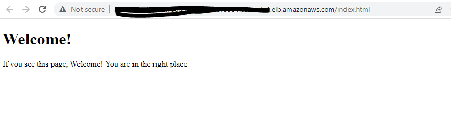
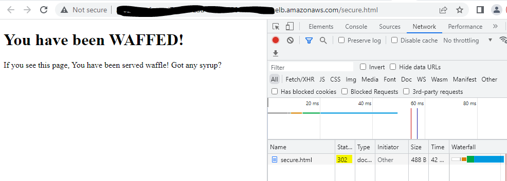

# Welcome to AWS WAF Project

This project uses AWS CDK to create the entire infrastructure.

# Application Artifacts: 
* Uses a L3 construct to deploy NGINX WebServer into ecs fargate with ALB.
* Deploys AWS WAF with all available AWS managed Rules.
* Deploys a Custom rule to deny access to a specific resource.
  * The system will display WAF message with a 302 response code.  You will have handle the 302 and display specific page.  Hint, that can be done in alb.
  * If you have many custom rules, this is where you will have to manage those.

## Seeing is Believing:
* `Here is an example of where we passed WAF rules.`

* `Here is an example of where the webpage is blocked by WAF rules with a 302 response code.`
